

# Método de `Vogel`.

**¿Quién lo creo?**

*William R. Vogel*.
Su método de aproximación fue desarrollado por él y es una técnica matemática para resolver problemas relacionados con la logística. El método permite llegar a una solución inicial factible del problema de transporte, que es una aplicación de la programación lineal, el cual consiste en decidir cuántas unidades trasladar dsde cierto puntos de origen `plantas, ciudades, etc` a ciertos puntos de destino `centros de distribución, ciudades, etc` de modo de minimizar los costos de transporte, dada la oferta y demanda en dichos puntos. Se suponen conocidos los costos unidatarios de transporte, los requerimientos de demanda y la oferta disponible.

## Introducción al método.

Para comenzar con este método primero veremos una tabla de tareas de ejemplo, en esta tabla el problema de transporte es de tres depósitos, que tienen que abastecer a 3 locales de diferentes zonas.

    
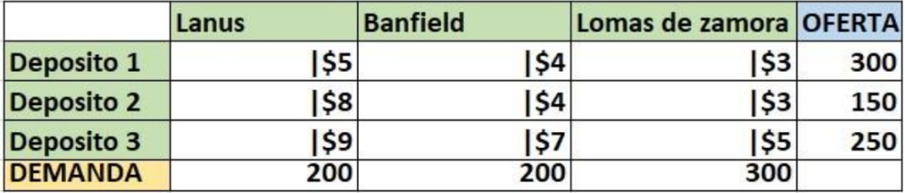    

El primer paso debemos sumar la demanda de cada local `Lanús, Banfield y Lomas de Zamora`, y comparar con la oferta de los tres depósitos también sumados. A continuación, una imagen de ejemplo.

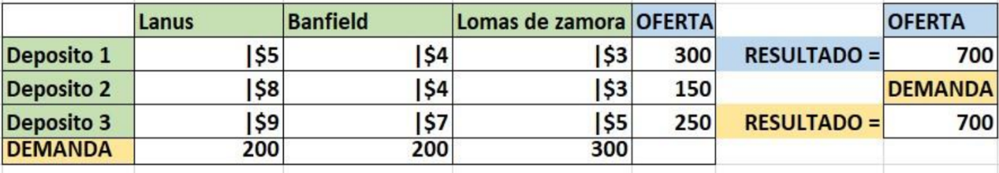

Como podemos apreciar, tanto como la oferta y la demanda es la misma, así que podemos seguir con el método de `Vogel`.

El primer paso a seguir es sacar los números de penalización, para lograr eso debemos identificar los dos números de costos más bajos y entre esos dos números restarlos, el resultado será el número de penalización; debemos hacerlo tanto como por las columnas y las filas. A continuación, una imagen de ejemplo:

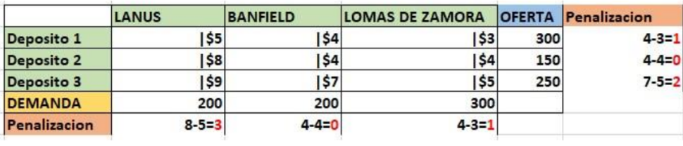

Veamos las siguientes imágenes de ejemplo:

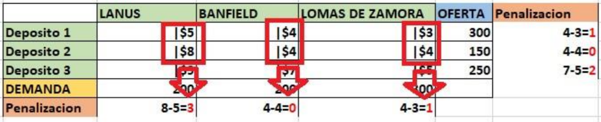

Esta imagen da el ejemplo con las columnas, ahora veamos con las filas:

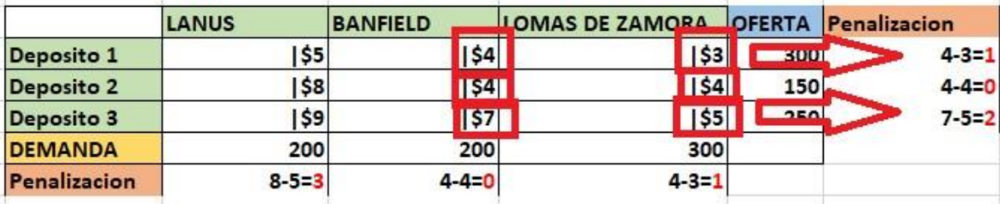

La próxima imagen solo dejaremos los números de penalización:

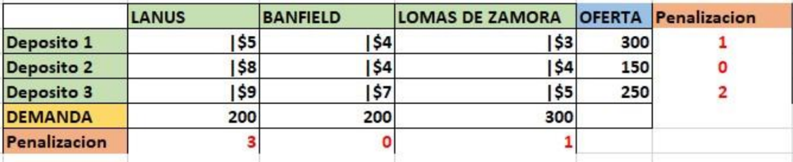

Una vez que ya tengamos todos los números de penalización, debemos buscar el mayor (en este ejemplo sería el numero 3)

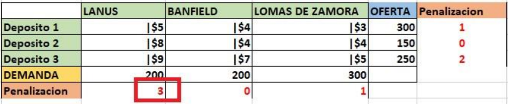

Como nuestro número de penalización más grande es el 3, Que se encuentra en la columna `LANUS` esa sería la columna predeterminada para asignar el primer valor, en esa columna asignaremos el máximo posible al costo más bajo, que tenga esa columna. En este caso sería columna `LANUS`, Deposito 1 con el costo de `$5`.

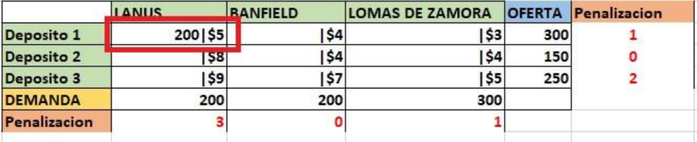

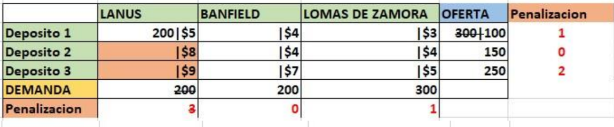

Una vez hecha la primer asignación, para hacer la siguiente debemos volver a sacar los nunero de penalización.

En este ejemplo no cambiaran se mantiene los mismos, así que deberemos volver a buscar cual es el número de penalización más alto.

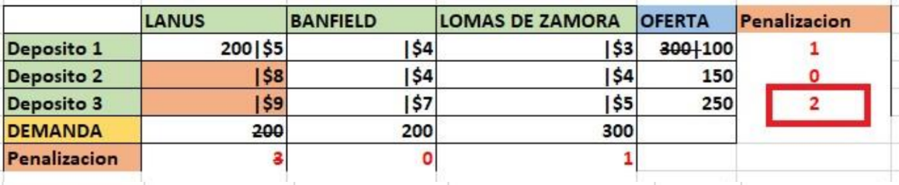

Como podemos ver el número de penalización más alto es el 2
, lo siguiente seria asignar el máximo posible al costo más bajo, en este caso sería el `$5`, de la columna `LOMAS DE ZAMORA` y la fila Deposito 3.

*Veamos cómo nos queda la tabla de tarea*:

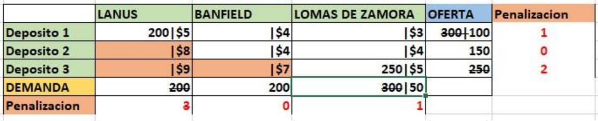

Nos quedan pocas celdas por asignar, una vez más volvemos a buscar el número de penalización más alto, en este caso sería el 1, tanto por `LOMAS DE ZAMORA` y por Deposito 1, buscamos el costo más bajo que seria `$3` y asignamos lo maximo posible.

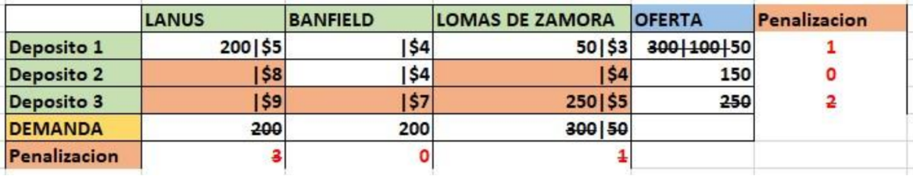

A los dos últimas celdas le daremos el resto que nos queda por asignar, veamos cómo nos queda finalmente la tabla de tarea:

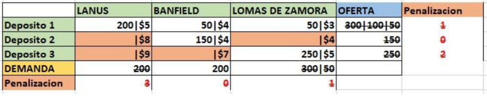

Ahora solo nos queda hacer el cálculo, de la solución inicial factible. Es la siguiente:

(200 x 5) + (50 x 4) + (150 x 4) + (50 x 3) + (250 x 5) = 3.200 *S.I.F*

**Ejercicios**

1. Resuelva la siguiente tabla con el método de Vogel.

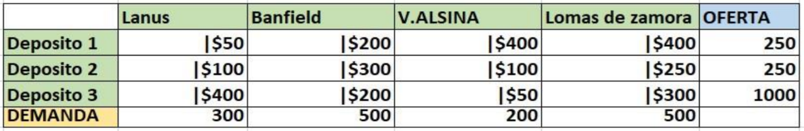

2. Resuelva la siguiente tabla con el método de Vogel.

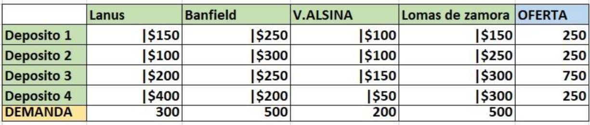

3. En la siguiente tabla el costo se cambia por unidad de tiempo, los segundos se representan con `''` y los minutos con `'`. Y ejemplo cambia en un problema de optimización de una fábrica de guarda polvos. Veamos la tabla de tarea:

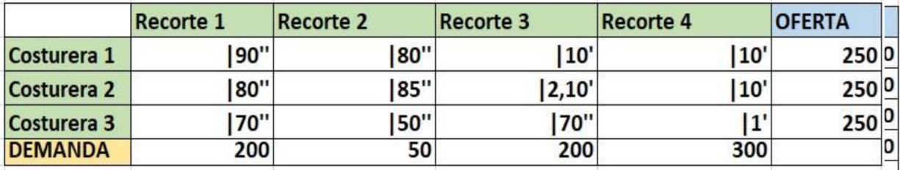

4. Enunciado: Debemos realizar la tabla de tareas mediante los datos obtenidos:

`Primer dato`: Casa central de la logística **Andreani**, se encuentra en la dirección Av. Corrientes
455, CABA

Tenemos 5 vehículos a disposición (3 semis y 2 camiones) que son los siguientes:

- IVECO daily (Tiene un gasto de $100 por kilómetro con una carga de 10 VC).

- SCANIA r730 (Tiene un gasto de $120 por kilómetro con una carga de 25VC).

- VOLVO f12 (Tiene un gasto de $115 por kilómetro con una carga de 25VC).

- FORD f350 (Tiene un gasto de $125 por kilómetro con una carga de 25 VC).

- MERCEDES BENZ sprínter (Tiene un gasto de $90 por kilómetro con una carga de 15 bultos).

`Segundo dato`: Con estos vehículos tenemos que abastecer la demanda de 6 depósitos de la logística **Andrean**. A continuación, dirección y demanda de cada supermercado.

- `Deposito Andreani` Av. Belgrano 1211, CABA. Demanda de 10 VC.

- `Deposito Andreani` Lavalle 1354, C1048 CABA. Demanda de 10 VC.

- `Deposito Andreani` dirección Bartolomé Mitre 2815, C1201 CABA. Demanda de 20 VC.

- `Deposito Andreani` dirección Fitz Roy 2292, caba. Demanda de 25 VC.

- `Deposito Vía cargo` dirección Viamonte 985, caba. Demanda de 5 VC.

- `Deposito Vía cargo` dirección Av. Belgrano 1129, caba. Demanda de 30 VC.

Una vez realizado la tabla de tarea, debemos sacar la solución inicial con el método de `Vogel`.

